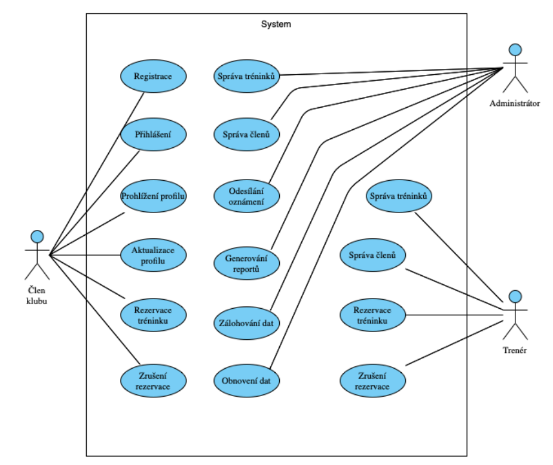

# Karate Club
The Karate Club Management app manages members, tournaments, and notifications, supporting role-based access and data storage for payments and achievements.

This project uses Java Spring Boot for the development of the backend. Below are the main features and technologies that our project includes:

## 📌 Main Features

- **Java Spring Boot**: We use Spring Boot for rapid and efficient backend development.
- **Docker**: The project is containerized using Docker, which simplifies deployment and dependency management.
- **REST technologies**: Our API is designed according to REST principles.
- **Hazelcast Cache**: We use Hazelcast technology for data caching, which improves performance and optimizes the application's response time.
- **Design Patterns**: More details below.
- **MVC Architecture**: The project is structured using the Model-View-Controller (MVC) architecture.

## 📌 Design Patterns

The following design patterns are implemented in the project:

- **DAO (Data Access Object)**
- **DTO (Data Transfer Object)**: We use this in the `Member` class for data transfer.
- **Builder**: Implemented in the `TournamentResult` class for creating instances with multiple optional parameters.
- **Strategy**: We use this in the `NotificationStrategy` class to define different notification strategies.

 ## 📌 Functionality
  
Here is a demonstration of the project's functionality:

### **Creating clubs, making changes to them, and deleting them.**

### **Adding and modifying participants.**

### **Performing operations with tournaments and tournament results.**

### **Sending notifications.**

## 📌 UML Class Diagram

## 📌 Use Case Diagram

## 📌 SWOT Analysis

## 📌 Getting Started

1. Clone this repository to your local environment.
2. Make sure you have Docker installed.
3. Start the project by following the instructions for running the project using Docker.

## 📌 Contact

For more information or inquiries, please contact Alina Voropaeva via email at [voropali@fel.cvut.cz].

We hope our project will be useful to you!
